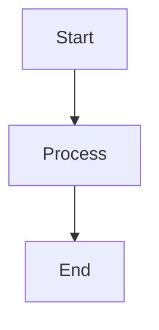

# Documentation Style Guide

**Status:** Draft - For Review  
**Last Updated:** 2026-02-18  
**Purpose:** Standardize documentation structure and prevent duplication

---

## 1. Doc Types and Templates

### 1.1 Guide Template

**Purpose:** Scenario-driven, step-by-step learning for users

**When to use:** When documenting a workflow or how to accomplish a task

**Structure:**
```markdown
---
title: "Guide Title"
description: "Brief description of what this guide covers"
authors: ["author-name"]
---

# Guide Title

## Overview

Brief introduction to the scenario and what the user will accomplish.

## Prerequisites

- [ ] Prerequisite 1
- [ ] Prerequisite 2
- [ ] Prerequisite 3

## Steps

### Step 1: [Step title]

[Detailed instructions with code examples]

```bash
# Example command
command --option value
```

### Step 2: [Step title]

[Detailed instructions with code examples]

## Verification

How to verify the task was completed successfully.

## Next Steps

- [Link to related guide]
- [Link to reference documentation]
- [Link to troubleshooting guide]

## Troubleshooting

Common issues and solutions for this scenario.
```

### 1.2 Reference Template

**Purpose:** Exhaustive, canonical reference for interfaces and configurations

**When to use:** When documenting API signatures, config schemas, or command options

**Structure:**
```markdown
---
title: "Reference Title"
description: "Exhaustive reference documentation"
---

# Reference Title

## Overview

Canonical reference for [what this reference covers].

## [Section Title]

### [Subsection Title]

[Description of what this section covers]

#### Syntax

```yaml
# Example configuration
key: value
```

#### Parameters

| Parameter | Type | Required | Default | Description |
|-----------|------|----------|---------|-------------|
| `param1` | `string` | Yes | - | Description of param1 |
| `param2` | `integer` | No | `0` | Description of param2 |

#### Examples

##### Example 1: [Description]

```yaml
# Configuration example
key: value
```

## Related

- [Link to guide that uses this reference]
- [Link to architecture overview]
```

### 1.3 Runbook Template

**Purpose:** Operational procedures for maintaining the system

**When to use:** When documenting deployment, maintenance, or troubleshooting procedures

**Structure:**
```markdown
---
title: "Runbook Title"
description: "Operational procedure for [what this runbook does]"
---

# Runbook Title

## Overview

Brief description of what this runbook accomplishes.

## Prerequisites

- [ ] Prerequisite 1
- [ ] Prerequisite 2

## Procedure

### Step 1: [Step title]

[Detailed instructions]

### Step 2: [Step title]

[Detailed instructions]

## Verification

How to verify the procedure was successful.

## Rollback

If applicable, how to rollback if something goes wrong.

## Related

- [Link to reference documentation]
- [Link to troubleshooting guide]
```

### 1.4 Architecture Note Template

**Purpose:** Document system design decisions and architecture

**When to use:** When documenting architectural decisions, diagrams, or system contracts

**Structure:**
```markdown
---
title: "Architecture Note: [Title]"
description: "Architecture decision or system design documentation"
---

# Architecture Note: [Title]

## Overview

Brief description of the architecture decision or system component.

## Diagram

[Mermaid diagram or ASCII diagram]



## Components

### Component 1: [Name]

[Description of the component and its responsibilities]

### Component 2: [Name]

[Description of the component and its responsibilities]

## Interactions

[Description of how components interact]

## Decisions

| Decision | Rationale | Alternatives Considered |
|----------|-----------|------------------------|
| Decision 1 | Rationale for decision 1 | Alternative 1, Alternative 2 |

## Related

- [Link to reference documentation]
- [Link to operational runbook]
```

---

## 2. Duplication Prevention Rules

### 2.1 Link, Don't Copy

**Rule:** Never copy configuration tables, API definitions, or reference material from one doc to another.

**Instead:** Link to the canonical reference page.

**Example:**

❌ **Bad:** Copying the config schema table into a guide

```markdown
# Guide with copied config

The following config options are available:

| Option | Type | Description |
|--------|------|-------------|
| `foo` | `string` | Foo option |
| `bar` | `integer` | Bar option |
```

✅ **Good:** Linking to the canonical reference

```markdown
# Guide with link

For configuration options, see [Config Schema Reference](../reference/config-schema.md#parameters).
```

### 2.2 Single Source of Truth

**Rule:** Each piece of information lives in exactly one place.

**Examples:**
- CLI command options live in `docs/reference/cli.md`
- Config schema lives in `docs/reference/config-schema.md`
- API definitions live in `docs/reference/api.md`

### 2.3 Reference Pages Are Standalone

**Rule:** Reference pages should be self-contained and minimally link to other docs.

**Rationale:** Users often land on reference pages via search or direct link and need the information immediately.

### 2.4 Guides Link to Reference

**Rule:** Guides should link to reference pages for detailed information.

**Rationale:** Guides are for learning; references are for looking up details.

---

## 3. File Naming Conventions

### 3.1 Directory Names

- Use kebab-case: `getting-started/`, `guides/`, `reference/`
- Avoid underscores or camelCase

### 3.2 File Names

- Use kebab-case: `creating-taskcards.md`, `ai-governance.md`
- Avoid spaces or special characters
- Use lowercase

### 3.3 Index Files

- Every directory must have an `index.md` file
- Index files serve as the directory home page

---

## 4. Linking Conventions

### 4.1 Relative Links

Use relative links within the docs structure:

```markdown
[Link to guide](../guides/creating-taskcards.md)
[Link to reference](../reference/cli.md)
```

### 4.2 Absolute Links

Use absolute links from the docs root:

```markdown
[Getting Started](/getting-started/)
[Reference](/reference/)
```

### 4.3 Cross-Subdomain Links

For multi-subdomain docs, use absolute links:

```markdown
[Blog Post](https://blog.foss-launcher.io/post)
```

---

## 5. Root Hygiene Rule

**Hard Rule:** Never create new docs in the `docs/` root directory.

**Allowed in docs root:**
- `README.md` - Documentation home and navigation
- `_audit/` - Audit outputs folder
- `_archive/` - Archived documentation folder

**Prohibited in docs root:**
- Any other `.md` files
- Any other directories (except `_audit/` and `_archive/`)
- Any configuration files
- Any scripts or executables

**Rationale:** A flat root with only a few meta-folders keeps the documentation structure clean and navigable.

---

## 6. Content Quality Standards

### 6.1 Clarity

- Use active voice
- Avoid jargon or define it
- Use short, clear sentences

### 6.2 Completeness

- Include all necessary steps
- Provide examples for common scenarios
- Link to related documentation

### 6.3 Accuracy

- Verify all commands and code snippets
- Keep references up to date
- Test all procedures

### 6.4 Consistency

- Use the same terminology throughout
- Follow the same formatting conventions
- Maintain a consistent tone

---

## 7. Review Checklist

Before publishing a doc, verify:

- [ ] Is the doc in the correct location per the IA?
- [ ] Does it link to canonical references instead of duplicating them?
- [ ] Are all examples tested and accurate?
- [ ] Are all links working and using the correct format?
- [ ] Does it follow the appropriate template?
- [ ] Is the file name in kebab-case?
- [ ] Does the directory have an `index.md`?

---

## 8. Top 15 Pages We Must End Up With

| # | Title | Target Path | Type |
|---|-------|-------------|------|
| 1 | Documentation Home | `docs/README.md` | Navigation |
| 2 | Overview Home | `docs/overview/index.md` | Navigation |
| 3 | What is FOSS Launcher? | `docs/overview/what-is-foss-launcher.md` | Concept |
| 4 | Core Concepts | `docs/overview/core-concepts.md` | Concept |
| 5 | Getting Started Home | `docs/getting-started/index.md` | Navigation |
| 6 | For Users | `docs/getting-started/for-users.md` | Quickstart |
| 7 | For Operators | `docs/getting-started/for-operators.md` | Quickstart |
| 8 | For Contributors | `docs/getting-started/for-contributors.md` | Quickstart |
| 9 | AI Governance | `docs/guides/ai-governance.md` | Guide |
| 10 | Creating Taskcards | `docs/guides/creating-taskcards.md` | Guide |
| 11 | CLI Reference | `docs/reference/cli.md` | Reference |
| 12 | Config Schema | `docs/reference/config-schema.md` | Reference |
| 13 | LLM Models | `docs/reference/llm-models.md` | Reference |
| 14 | Telemetry API | `docs/reference/telemetry-api.md` | Reference |
| 15 | System Architecture | `docs/architecture/system-overview.md` | Architecture |
